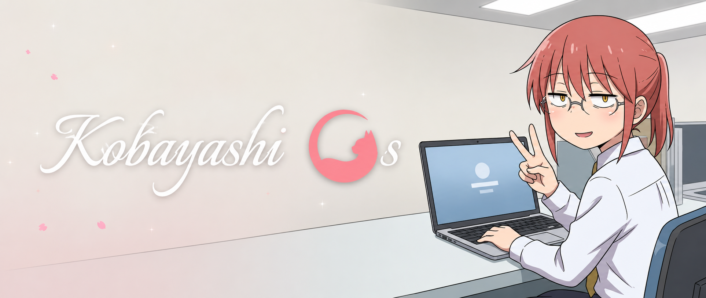
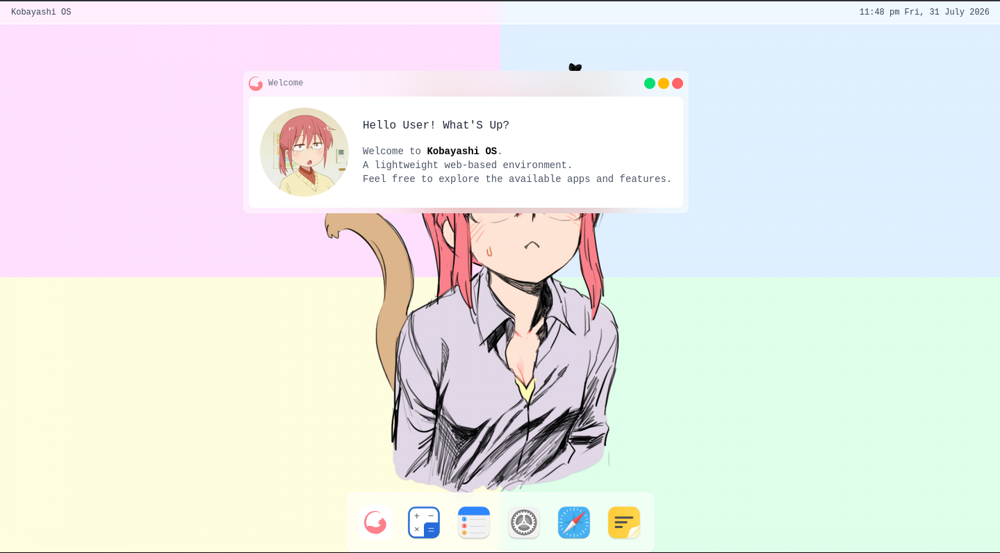
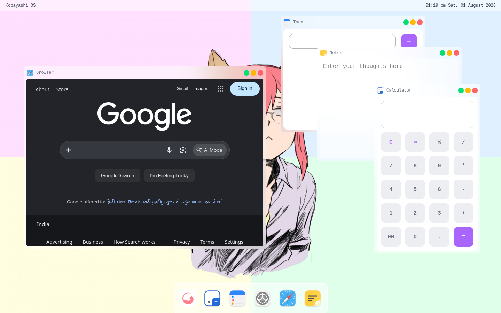
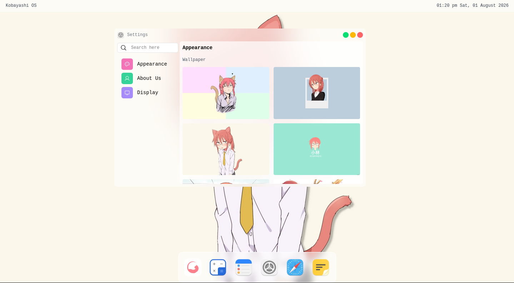
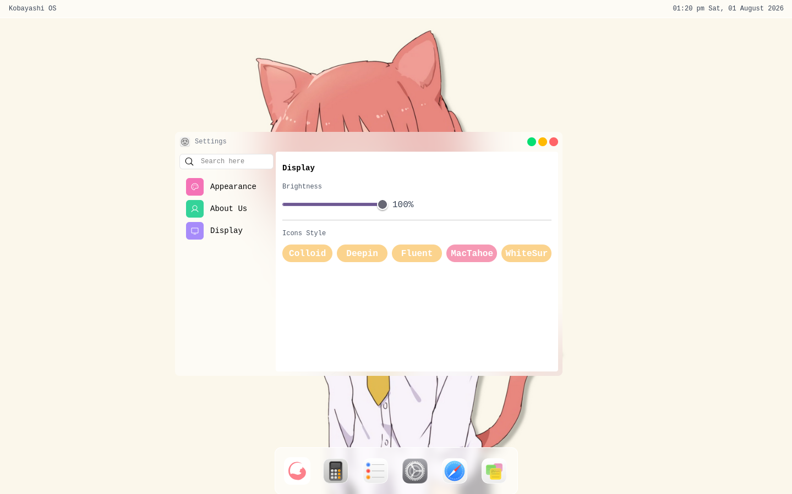

# Kobayashi OS
<p align="center">
  
</p>

A browser-based desktop environment built with React, TypeScript, JavaScript, Bun, Tailwind CSS, and Zustand.

Kobayashi OS is my take on building a Web Operating System. Inspired by modern desktop environments and anime-themed interfaces, the project focuses on window management, desktop customization, and recreating the feel of using a real operating system in the browser.

Multiple instances of the same application can be opened, allowing the desktop to behave more like a traditional operating system.

> **Version 1.0 is Live!**
>
> Version 1.0 includes Notes, Calculator, Settings, Browser, and To-Dos. The Settings app currently supports brightness control, wallpaper customization, and icon style customization. Development is still ongoing, with more applications and features planned for future updates.

## Features

- **Window Manager** — Draggable windows with proper layering and support for multiple instances of the same application.
- **Desktop Customization** — Change wallpapers, desktop icons, and screen brightness.
- **Built-in Applications** — Notes, Calculator, Browser, Settings, and To-Dos.
- **Persistent State** — Settings and application data are saved using Local Storage.
- **State Management** — Global state powered by Zustand.

> **Note**
> Some applications are still under development and currently use placeholder alerts. They will be replaced with full implementations in future updates. Additional functionality will be added in future releases.

## Built With

<p align="left">
  
  
  
  
</p>

- **Core Stack:** HTML5, JavaScript, TypeScript, React, Vite, Tailwind CSS, Bun
- **State & Window Management:** Modern React architecture with seamless window dragging, layering, and state synchronization.
- **State Management:** Zustand

## Live Demo
🔗 **Try Kobayashi OS:** <https://dev-dock-ruddy.vercel.app/>

## Quick Start

Get a local copy up and running in a few simple steps:

```bash
# Clone the repository
git clone https://github.com/anshumitasahu/Kobayashi--OS.git

# Navigate to the project directory
cd Kobayashi--OS

# Install dependencies
bun install

# Start the development server
bun dev
```

## Screenshots
<p align="center">
  
  
</p>

<p align="center">
  
</p>

<p align="center">
  
  
</p>

## Contributing

Contributions, issues, and feature requests are welcome!
Feel free to open an issue to report bugs, suggest features, or submit a pull request.